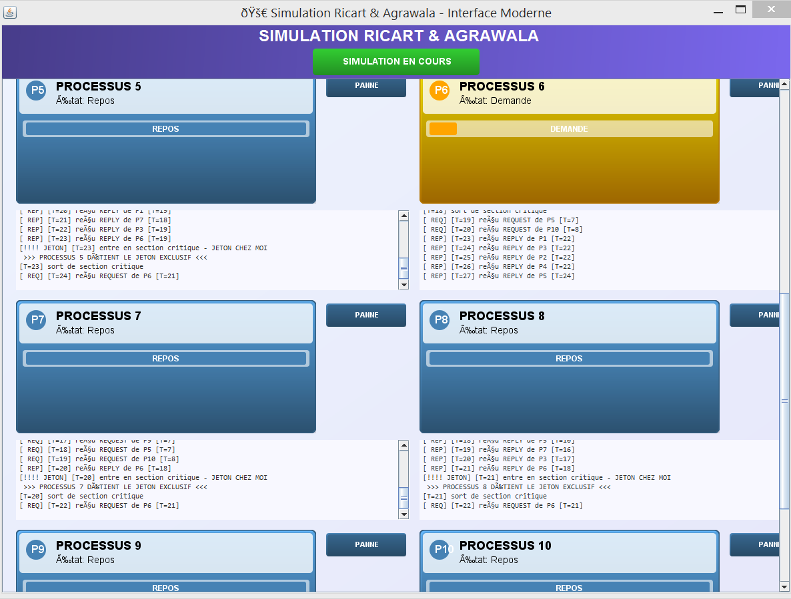

# Ricart & Agrawala Distributed Mutual Exclusion (Java)

In this project, I implemented a simulation of the Ricart & Agrawala algorithm for mutual exclusion, as part of my Distributed Systems course.

The goal was to simulate 10 peer processes managing access to a shared critical section using socket-based communication and multithreading. I also added failure simulation and a simple GUI to track the state of each process in real time.

---

###  Key Concepts Explored:

- Socket communication between peer processes
- Multithreading for handling concurrent message exchanges
- Critical section management using Ricart & Agrawala's algorithm
- Random delays for request and execution phases
- Simulation of process failures
- Real-time graphical visualization

---

###  How It Works:

- Each of the 10 processes acts as both a client and a server.
- Processes send request messages to all others before entering the critical section.
- Mutual exclusion is guaranteed using timestamp-based replies.
- Failures are  introduced by user(button) to simulate crashes or delays.
- The GUI updates to show whether a process is idle, waiting, or in its critical section.

---

###  Demo Screenshots:

####  Initial 

####  Processes 

####  Critical Section Execution

---

###  How to Run:

# 1. Clone the repository
git clone https://github.com/Larb-YasmineBadrElhouda/Ricart-Agrawala--83--Sim.git

# 2. Move into the project directory
cd Ricart-Agrawala--83--Sim

# 3. Compile the Java file
javac RicartAgrawalaSimulation.java

# 4. Run  
java RicartAgrawalaSimulation

